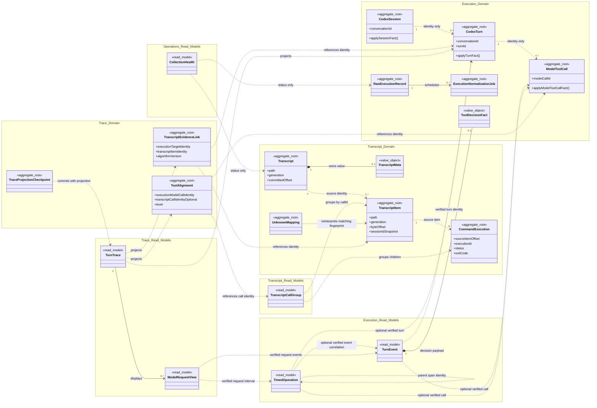
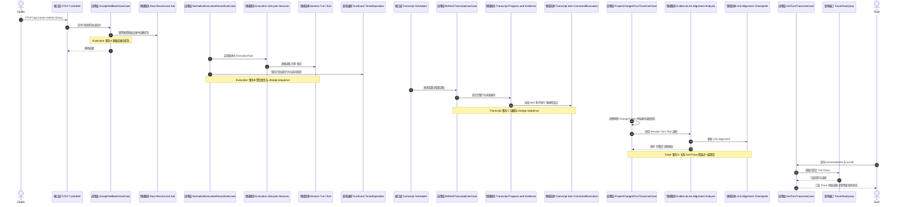

# 技术设计

## 系统形态

产品是本地 Web 应用。Java 进程负责数据采集、解析、存储和查询；Vue 页面负责可视化分析。发布时前端静态资源嵌入 Spring Boot JAR，开发时前后端独立启动。

## S2.2 目标架构决策：OTel + Transcript

用户于 2026-09-18 确认 V1.0 目标运行架构只融合 OTel 与 Transcript。OTel 是 Execution 的正式核心行为遥测与性能入站来源，负责官方已定义的 Session/Turn 身份、事件、请求/工具遥测、Span 父子关系和性能；Transcript 独立负责用户可见内容、工具参数/结果、历史增量读取和原始 JSONL。Hook 不进入目标模型，也不作为可选兜底；现有 Hook、forwarder、表和代码只在迁移完成前作为历史实现保留。

该选择优于另外两种组合：

| 组合 | 结论 | 技术原因 |
| --- | --- | --- |
| Hook + OTel + Transcript | 不选 | 重复维护 Session/Turn/Tool 事实与两组跨源关联；Hook 无官方事件时间、无历史重放、覆盖不完整，且不能替代 OTel 的 API/TTFT/父子 Span |
| OTel + Transcript | 选择 | Session/Turn 已有经样本验证的公共身份；两个来源分别完整覆盖执行/性能与内容/历史，边界清晰且采集链路最少 |
| Hook + Transcript | 不选 | 缺失 API、TTFT、传输回退、Span 父子关系和精确性能，不能满足产品核心目标 |

“以 OTel 为准”采用字段级事实所有权，不允许整条记录互相覆盖：

- Execution 的存在、生命周期、状态、事件时间和性能字段以 OTel 为准。
- 用户输入、模型可见输出、reasoning summary、工具参数/结果和 JSONL 原文以 Transcript 为准。
- Session/Turn 跨源身份只有在 `conversation.id == session_meta.session_id` 且同 Session 下 `turn.id == TranscriptItem.turnId` 时才是 `EXACT`；不一致时不合并。
- Transcript `callId` 是内容侧 Tool Call 身份。Codex 0.154.0 本地工具的 OTel `call_id` 已验证与模型级 `custom_tool_call.call_id` 同值，可产生 Tool `EXACT`；hosted tools、其他版本或没有已验证共同身份的记录按类型、事件时间和顺序产生 `INFERRED` 候选，歧义时保持 `UNMATCHED`。

V1.0 不把“采用 OTel + Transcript”解释为“两源是 Hook 的无损超集”。官方 OTel events/metrics、目标版本真实 OTLP 样本与 Transcript 已支持记录构成 V1.0 能力边界；匿名指标目录本身不证明本地 OTLP 可得，真实样本可以形成 `VERSIONED_SAMPLE` 证据。Metrics 仍不能创建单次 Execution Event。V1.0 能力覆盖与“不支持”结论已记录在 [来源覆盖可行性](./15-v1-source-coverage-feasibility.md)；后续 Story 以该矩阵和版本化契约定义适配器及缺失态，不要求逐事件复刻 Hook。

本地工具级与 Turn 终态样本已经取得。用户于 2026-09-21 确认：hosted tool 级身份、状态和耗时移出 V1.0，并登记为 V1.1 TODO；本地命令结果由 Transcript `CommandExecution.status/exit_code` 独占，缺失时为 `UNKNOWN`；一个模型 `custom_tool_call` 包含多个并行 `CommandExecution` 时，保留一个模型 Tool Call 及其多个子执行，不扁平化为多个同级 Tool Call；审批只展示已验证的批准/拒绝决策，等待耗时与诊断移至 V1.1。父调用按模型 Call ID 计数，子执行按自身身份计数；父耗时使用父 Span 或整体区间，不对子执行耗时求和。产品语义裁决、规格一致性和 V3 原型人工门禁均已完成；当前处于技术方案设计，迁移 Story 尚未拆分，正式代码迁移尚未启动。

审批决策由版本化 OTel 适配器转换为 `ToolDecisionFact`，只保存决定、来源、事件时间和已有身份。Codex 0.154.0 未验证等待起点、持续时间和稳定工具调用身份，因此 Execution 不创建审批等待 Span，Trace 不计算审批等待耗时；Turn 中无法归因的对应区间继续归入 `UNATTRIBUTED`。V1.1 若取得直接契约证据，必须重新设计身份、生命周期、耗时守恒和诊断规则，不能用决策时间倒推等待开始时间。

### 目标问题域与上下文

OTel 和 JSONL 是入站协议/证据格式，不是问题域。目标上下文如下：

| 上下文 | 类型 | 所有数据与能力 | 对外契约 |
| --- | --- | --- | --- |
| Execution | 核心域 | 由版本化 OTel 适配器接收的原始执行证据、Codex Session、Codex Turn、执行事件和性能 Span | `ExecutionTurnQuery`、`ChangedExecutionTurnQuery` |
| Transcript | 支撑域 | Transcript、Meta、Item、UNKNOWN、内容侧 Tool Call 分组和增量检查点 | `TranscriptQuery`、`TranscriptItemQuery`、`ChangedTranscriptTurnQuery` |
| Trace | 核心域 | Transcript Evidence Link、Tool Alignment、Turn Trace 投影和消费检查点 | `TraceViewQuery` |
| Operations | 支撑域 | OTel/Transcript 接收状态、队列和运行期指标摘要 | 各采集面状态 Query |

```text
Codex OTLP -> Execution --ExecutionTurn/ChangeFeed--+
Codex JSONL -> Transcript --TranscriptItem/ChangeFeed-+--> Trace --> TraceViewQuery --> HTTP
Execution / Transcript --status summaries-----------> Operations
```

Execution 使用业务语言，不把 Session/Turn 聚合命名为 OTel 聚合。OTLP Controller 位于 Execution 的 Interfaces，protobuf 解码和生产者字段映射位于 Infrastructure 适配器；Domain 不依赖 OTLP、protobuf 或具体 Codex 版本。版本化适配器把经过验证的 `conversation.id`、`turn.id`、事件名、状态和时间转换为结构化 `ExecutionFact`。

### 目标上下文协作与主流程

上游上下文各自拥有原始事实、写模型与单调 Change Feed。跨上下文只传稳定业务身份、来源 revision、适配器版本和必要的只读证据 DTO；Trace 不能访问上游聚合对象、Repository 或 Mapper，Operations 不能回写业务事实。日志是横切基础设施，不是第五个业务上下文。目录按 `interfaces/<context>`、`application/<context>`、`domain/<context>`、`infrastructure/<context>` 分层，层内以这四个上下文组织。

1. Codex 将 logs、traces、metrics 以 OTLP/HTTP binary protobuf 投递到仅监听回环地址的三个接收端。Execution 的适配器解码、校验并保存原始对象和归一化任务；版本化映射把已验证的 log/trace 转为 Session、Turn、Model Tool Call 的生命周期事实，以及供查询的 Turn 行为记录和操作耗时区间。原始记录与任务同事务创建，业务状态由相应聚合的领域服务推进，变化与 `execution_change` 同事务提交。重复、乱序和延迟记录按协议身份幂等处理，使用事件自身时间和 Span 父子身份，不用接收顺序生成终态或耗时。Metric 只供聚合趋势，不创建单次 Turn 或工具节点。
2. Transcript 独立发现配置根目录内的 JSONL，验证安全规范 Path、文件 generation 和首条完整 `session_meta`，只读取新增完整行。`TranscriptItem`、`CommandExecution` 与文件检查点按有界批次同事务提交，并追加 `transcript_change`。UNKNOWN 和解析失败保留原始证据；Transcript 不查询 Execution，也不独立创建正式 Session、Turn 或 Trace。
3. Trace 至少一次消费两侧 Change Feed，按 OTel `conversation.id` 与 Transcript Meta `session_id`、同 Session 下 OTel `turn.id` 与 Item `turnId` 校验身份，再逐条建立可重算 Evidence Link 和 Tool Alignment。Codex 0.154.0 已验证的本地模型 Call ID 可得到工具级 `EXACT`；没有版本化公共 ID 时只保留可解释的候选，歧义为 `UNMATCHED`。Trace 在同一事务更新关系、Turn Trace 读模型及自己的消费检查点；失败不推进检查点，后到来源触发重算，不修改任一上游事实。
4. 查询以 `(conversationId, turnId)` 定位 Turn Trace。正式总览只列有 OTel 骨架的 Turn；详情返回 OTel 执行层、Transcript 内容层、OTel 性能层和独立的来源/关联证据，实时事件使用同一检查器。只有 OTel 时保留正式 Trace 并标记内容缺失或待补；只有 Transcript 时仅开放来源健康、原始记录与内容检查，不计算正式完整度或性能诊断。

Execution 的 Session、Turn 和 Model Tool Call 是独立一致性边界，不因父子展示关系加载整场会话。Application 编排一次事实涉及的多个聚合和事务；各领域服务封装单个聚合的读取、状态推进与保存。Transcript 文件批次、Execution 事实应用和 Trace 投影各用本域短事务，不创建跨域分布式事务。Operations 只组合健康查询模型，Turn Trace 也是查询读模型；两者不拥有上游事件或内容事实。

### 目标业务模型、聚合与查询证据

下表只把具有业务身份、生命周期和不变量的写模型称为聚合根。`RawExecutionRecord` 拥有原始 OTLP 证据；从中产生的行为记录与 Span 区间是可重建的查询证据，不因独立建表而自动成为聚合根。Transcript 的 Item 和命令子执行仍按各自身份独立只追加。页面中的 Session/Turn/Tool 父子展示、TranscriptItem 与命令子执行的父子展示，均不是跨上下文写聚合关系。聚合根各有 Repository；跨聚合读取使用 Query/Change Feed。

#### Execution 核心域

| 模型及类别 | 业务含义 | 严格身份、生命周期 | 不变量、写入入口与所有权 |
| --- | --- | --- | --- |
| `RawExecutionRecord`，聚合根 | 接收端实际收到的一份 OTLP 原始证据；是事后复核和重新解释的依据。 | 优先为 OTLP 协议身份；无可用身份时为 `(batchId, objectIndex)`。接受后只追加。 | `acceptExecutionRecord` 对同一来源身份幂等；保存原始对象和对应任务必须同事务。它拥有原始 OTLP，不决定 Turn 状态或跨源关联。 |
| `ExecutionNormalizationJob`，聚合根 | 将一份原始证据按某版本规则解释为执行事实的一次处理任务。 | 一份原始记录的一次适配器版本归一化任务；业务身份为 `(rawRecordId, adapterVersion)`。`PENDING -> RUNNING -> COMPLETED/FAILED`，失败允许有界重试。 | `claim/complete/failExecutionNormalization` 保证尝试次数和终态单调；任务与原始记录同事务创建，但不与 Raw Record 合成聚合。 |
| `CodexSession`，聚合根 | 一次 Codex conversation，承载多个可独立操作的执行轮次。 | OTel `conversation.id`。已观察、活动；只有直接的 Session 终态证据才进入终态，文件停止增长不构成终态。 | `applySessionFact` 只接受 OTel 身份和生命周期事实；不加载 Turn 集合，不由 Transcript 内容改变执行状态。 |
| `CodexTurn`，聚合根 | 从一次用户问题到本轮结束的一次执行，是 Trace 分析的主对象。 | `(conversationId, turnId)`；Turn ID 只在 Session 内唯一。已观察、运行中、成功、失败和中断由 OTel 事实推进；已开始但没有终态时对外归类为 `INCOMPLETE`。 | `applyTurnFact` 保护已有终态、事件时间和 revision；乱序补证据不回退状态，缺失终态不合成成功，Transcript 不创建正式 Turn。操作 Turn 直接从本根进入，不通过 Session 聚合。 |
| `ModelToolCall`，聚合根 | 模型在一个 Turn 中发起的一次工具调用；一次调用可包含多个本地命令子执行。 | `(conversationId, turnId, modelCallId)`；仅由已验证的 OTel 模型调用事实建立。开始、结果、失败或缺失终态可分别到达。 | `applyModelToolCallFact` 保存调用发生、父 Span 和整体区间；没有终态不合成成功。此身份与 Transcript Call ID 只有经版本验证才能建立 `EXACT`，与子 `CommandExecution.id` 永不混用。 |
| `TurnEvent`，查询证据，不是聚合根 | Turn 中一次有 OTel 证据的时间点事实，回答“何时发生了什么”；它不是持续执行的操作。 | 一次可归属到 `(conversationId, turnId)` 的 OTel 离散事件，如用户提交、模型请求事件、工具决策/结果或 Turn 终止；身份取事件协议身份，缺失时取原始记录身份与对象位置。 | 保留事件自身时间、业务种类、来源版本和原始引用。工具事件仍属于此类，只有经过验证的模型 Call ID 才关联 `ModelToolCall`；无 Turn 身份的启动/连接等事件只留原始记录或来源检查，不挂入正式 Turn。baseline 3 逻辑表 `execution_event` 是此查询证据的持久化投影。 |
| `TimedOperation`，查询证据，不是聚合根 | 一次被 OTel Span 观测到的有起止时间的操作，回答“哪项操作花了多久”；它不是离散事件。 | 一段由 OTel Span 证实的操作时间，身份为 `(traceId, spanId)`；种类可为模型 API、传输或工具。经版本验证、但没有 Span 的模型 Tool Call 整体区间留在 `ModelToolCall`，不伪造 Span。 | 保留原始父 Span 身份、开始/结束、状态和来源。可独立保存，只有可验证的 Turn 身份才进入正式 Trace；工具归属还须已验证的模型调用身份。没有工具关联的 Span 可以属于模型请求或其他 Turn 内操作；与事件的关联另按共同请求/调用身份判定。无效或负区间不计入统计。baseline 3 逻辑表 `execution_performance_span` 是此查询证据的持久化投影。 |

`TurnEvent` 与 `TimedOperation` 由版本化适配器和领域证据策略生成，由 Execution 的投影写入端口保存；它们不暴露 Repository，也不接受用户命令。OTLP 原始 Record 即使无法归属 Turn 或 Tool，也必须独立保留，以便来源检查和适配器升级后重算。

四者关系固定为：`CodexTurn` 是一次用户问题的执行聚合；`ModelToolCall` 是该 Turn 中一次模型工具调用的独立聚合，保存完整 Turn 身份，但不装入 Turn 聚合。`TurnEvent` 是该 Turn 的离散时间点证据，包含工具事件，并非“除工具以外的操作”；`TimedOperation` 是可测量的区间证据。一个 Turn 可有多个 Tool Call、事件与 Span；一个 Tool Call 可被多个事件描述，并在有相应证据时关联零个或多个 Span。

#### OTel 原生关系与业务关联判定

OTLP `Span` 自带 `traceId`、`spanId`、可选 `parentSpanId`、起止时间、属性及可选的内嵌 `Span.events`。内嵌事件天然属于该 Span；它仍不自动属于某个业务 Tool Call。独立发送的 `LogRecord` 可以携带 `traceId/spanId` 来指向观测上下文，也可以没有这些字段；只有字段实际存在且对应 Span 可查时，才能据此建立直接的 LogRecord-Span 关联。OTLP Span 本身没有必须指向 Tool Call 或独立 LogRecord 的字段；Codex 的 `conversation.id`、`turn.id`、`call_id` 等是生产者提供的业务属性，需要按版本核验其含义。`TurnEvent` 是有 Turn 身份的 LogRecord 或 Span 内嵌事件的查询投影，须保留来源类型和原始 Span 引用；不能把两种 OTel 事件的关系混为一谈。

OTel 观测关系与业务关系分开判定：

1. **Turn 范围**：Span 只有携带经版本化契约验证的 `(conversationId, turnId)`，或有同等强度的可验证关联，才进入正式 Turn Trace。无法确认 Turn 的 Span 仍保留原始 OTLP 及可重建的来源证据，不显示为某个 Turn 的 `TimedOperation`。
2. **业务调用归属**：在 Turn 内，Span 可关联已验证身份的 `ModelToolCall`、`ModelRequestView`，也可只作为未分配给具体调用的 Turn 性能证据。Span 有工具名称、时间重叠或共同 `traceId`，均不足以单独证明属于某个模型 Tool Call；模型请求/传输 Span 不因与工具 Span 相邻而归属于工具。
3. **事件关联**：`TurnEvent` 是时间点投影；`TimedOperation` 是 Span 区间投影。Span 内嵌事件按 OTel 结构直接关联该 Span；独立 LogRecord 优先用实际携带的 `traceId/spanId` 关联，再按版本化契约验证的请求 ID 或模型 Call ID 关联同一次业务操作。若一个模型请求的开始、结束 LogRecord 和 Span 均有同一已验证请求 ID，它们应关联到同一个 `ModelRequestView`；Span 不归属于其中某一个 LogRecord。没有上述证据时，不按时间接近建立专属关系。
4. **Span 父子关系**：`parentSpanId` 只说明生产者在 OTel trace 中记录的观测上下文。例如一个请求 Span 的子传输 Span 仍是模型请求的性能细节，不能仅凭父子关系认作工具调用。DDD 聚合边界另由业务命令入口与同事务不变量决定；`CodexTurn` 与 `ModelToolCall` 各自独立，`TimedOperation` 也不是它们内部需要同事务维护的领域实体。

以下是**条件性合成案例**，用于说明 OTLP 允许的证据组合及相应判定，不是 Codex 0.154.0 实际发出了所列全部 Span、事件或字段的证据。假设版本化适配器已验证本例中的 Turn 身份、`requestId`、`modelCallId` 及工具 Span 上的调用 ID 语义；未验证的生产者版本只能保留候选或未关联状态。

| 时间（ms） | 收到的合成事实 | 正式模型与关联结论 |
| --- | --- | --- |
| 0 | 用户提交事件，`conversationId=C1, turnId=U1` | `TurnEvent(E1)` 属于 `CodexTurn(C1,U1)`；用户提交本身不是耗时 Span。 |
| 10-90 | 模型 API Span `S1`，以及 10、90 ms 的请求开始事件 `E2`、结束事件 `E3`，三者均有经验证的 `requestId=R1` | `S1`、`TurnEvent(E2)`、`TurnEvent(E3)` 均关联 `ModelRequestView(R1)`；`S1` 也与 `E2/E3` 建立有证据的事件关联，但不归属于任一事件，也不属于 Tool Call。 |
| 100、170 | 工具调用开始/结果事件，`modelCallId=T1` | 同一 `ModelToolCall(C1,U1,T1)` 的两个 `TurnEvent`；调用按一个模型 Call ID 计数。 |
| 105-165、110-150 | 工具整体 Span `S2` 与其子执行 Span `S3`，均有已验证的 `modelCallId=T1`，`S3.parentSpanId=S2` | 两个 `TimedOperation` 均关联 T1；T1 的整体耗时取 S2 的 60 ms，不能把 S2 与 S3 相加为 100 ms。父子关系只表达本例的 OTel 观测链，工具归属依据各 Span 的已验证调用身份。 |
| 190、220 | 第二次工具调用开始/结果事件，`modelCallId=T2`；trace 未收到对应 Span | 建立 `ModelToolCall(C1,U1,T2)` 和两个工具 `TurnEvent`，关联 Span 数为 0；若无经验证的整体区间契约，T2 耗时为未知，不把两个事件时间点自动当作性能 Span。 |
| 240-300 | 第二次模型 API Span `S4`，`requestId=R2` | 属于 Turn 与 `ModelRequestView(R2)`；即使紧邻 T2，也不挂到 T2。 |
| 305-315 | `S5` 携带已验证 Turn 身份，但没有可验证请求/工具身份；没有内嵌事件，也没有带其 `spanId` 或共同业务身份的 LogRecord | `TimedOperation(S5)` 仅属于 Turn；其业务类别若无法由契约确定，进入未归因，不强行关联 `TurnEvent` 或 T2。 |
| 320-340 | 启动/连接 Span `S6`，没有可验证的 Turn 身份 | 保留原始 Span 与来源检查信息；不进入 `CodexTurn(C1,U1)` 的正式 Trace，即使时间落在该 Turn 内。 |

因此，`S1` 已与两个请求 `TurnEvent` 关联，但不归属于其中某一个；`S4/S5` 在合成案例中只有 Turn 范围，没有可验证的事件关联；`S6` 连 Turn 身份也无法确认，只是来源证据。零 Span 不等于零工具调用，多 Span 不等于多个工具调用；工具数量由模型 Call ID 决定，性能覆盖率单独计算。

实际样本边界：仓库提交的 Codex 0.154.0 脱敏契约只保存跨批次名称和属性键并集，不能证明单个 Span 的关联结构。2026-09-24 对本机忽略目录 `otel-data` 的 122 个 trace 批次和 221 个 log 批次做只读结构审计：按 OTLP 字段遍历，259 个 Span 自身携带 `turn.id/turn_id`；其中 241 个自身无 `call_id/tool.call_id/runtime_tool_call_id`、无 `Span.events`，也没有 `traceId/spanId` 同值的独立 LogRecord。这证明实际采样中存在**没有直接工具 ID 或事件关联字段的 Turn Span**，不是凭空假设。它不证明这些 Span 在业务上绝对不属于任何工具或事件：其他业务字段、祖先 Span 或请求关系仍需逐条核验。本次审计只核查直接父 Span 是否带上述工具 ID，241 个候选中没有直接父 Span 带该 ID；不据此声明所有祖先均已排除。S2/S3 所示工具父子 Span 仍是条件性合成结构，不能据此宣称生产者稳定输出；正式适配器需以逐 Span 的脱敏结构 fixture 和版本化测试锁定可用关联。

#### Transcript 支撑域

| 模型及类别 | 业务含义 | 严格身份、生命周期 | 不变量、写入入口与所有权 |
| --- | --- | --- | --- |
| `Transcript`，聚合根 | 一份可增量读取的 Codex JSONL 文件，记录文件身份和读取进度。 | 位于允许根目录内的安全规范 Path；同 Path 文件替换或截断增加 generation，检查点在当前 generation 内单调。 | `commitTranscriptBatch` 只推进至完整行；新 Item、命令子执行证据与字节检查点同事务提交。聚合只持文件状态与 `TranscriptMeta`，不加载全部 Item。 |
| `TranscriptMeta`，Transcript 内值对象 | 文件首条有效元数据提供的会话身份，是后续内容归属 Session 的来源。 | 首条受支持 `session_meta` 的 Session ID、来源位置和适配器版本；没有独立业务身份。 | 由版本化解析规则产生；缺失或不支持时 Item 的 Session ID 为空，不允许 Trace 建立正式内容链接。普通行不要求再次含 Session ID。 |
| `TranscriptItem`，聚合根 | JSONL 中一条完整记录及其可见内容、解析状态和原始证据。 | `(path, generation, byteOffset)`；一条完整 JSONL 行，创建后原始字节和文本不可变。 | `appendTranscriptItem` 保存 Path、Meta Session ID 快照、Turn/Call 候选、解析状态和原文；无效 JSON/UTF-8、UNKNOWN 仍保留，不推断 Execution 状态。 |
| `CommandExecution`，聚合根 | 某次模型工具调用内部的一次本地命令子执行，提供命令结果事实。 | `(path, generation, sourceItemOffset, executionId)`；由版本化 TranscriptItem 解析出的单次本地命令证据，创建后不可变。 | `appendCommandExecution` 保存内容侧区间、`status/exitCode`；缺失为 `UNKNOWN`。同一模型 Call 可有多个子执行，父调用计数和 OTel 耗时不由其汇总。 |
| `UnknownMapping`，聚合根 | 用户为一类未知 JSONL 结构发布的字段解释规则。 | 一个结构指纹的映射配置；指纹由排序后的叶子 JSONPath 与值类型确定，版本单调递增。 | `publishUnknownMapping` 只接受受限 JSONPath、基数和类型校验通过的版本；仅该指纹的原始 Item 可重新标准化，原文不变，不重放 OTel。 |

同一内容侧调用的原始 `turn_id` 可能不同；Trace 只在已验证的同一 Session 中，依据唯一 Turn 候选或公共模型 Call ID 判断归属，不任意选择其中一条 Item 的 Turn ID。

#### Trace 核心域

| 模型及类别 | 业务含义 | 严格身份、生命周期 | 不变量、写入入口与所有权 |
| --- | --- | --- | --- |
| `TranscriptEvidenceLink`，聚合根 | 一条 Transcript 内容与 OTel 执行目标之间可核验、可重算的关系。 | `(executionTargetIdentity, transcriptItemIdentity, algorithmVersion)`；目标包含完整 Turn 身份及可选的 Turn 内节点身份。只对建立的关系存在，`ACTIVE/STALE`，来源 revision 改变后失效并重算。 | `linkTranscriptItemToExecutionTarget` 仅在 Session/Turn 身份一致时给 Turn `EXACT`；具体节点无共同 ID 时至多 `BOUNDED`。身份冲突不创建 Link，失败字段和候选数留在 Trace 投影。 |
| `ToolAlignment`，聚合根 | OTel 模型工具调用与 Transcript 内容侧调用是否为同一次调用的关联结论。 | `(executionModelCallIdentity, algorithmVersion)`；可选关联的 Transcript Call 身份，`ACTIVE/STALE`。 | `alignModelToolCall` 仅对版本验证的公共 Call ID 给 `EXACT`；唯一的类型/时间/顺序候选至多 `INFERRED`，歧义为 `UNMATCHED` 且不填写目标 Call。 |
| `TraceProjectionCheckpoint`，聚合根 | Trace 已可靠处理到哪个上游变更位置，用于重启后继续投影。 | `(changeSource, consumerName)`；持久化的单调变更序列。 | `advanceTraceProjection` 只能与本批 Link、Alignment 和 Turn Trace 读模型在同一 Trace 事务提交；失败不推进。 |

#### 值对象与只读模型

| 模型及类别 | 业务含义 | 身份或生成规则与边界 |
| --- | --- | --- |
| `ExecutionFact`，值对象 | 从已验证 OTel 记录提取的一项 Session、Turn 或工具生命周期事实，供聚合应用规则。 | 由版本化适配器生成，携带来源身份、事件时间和适配器版本；本身不是持久化聚合，也不能凭未知字段构造终态。 |
| `ToolDecisionFact`，值对象 | 一次已观察到的工具批准或拒绝决定及其来源。 | 作为 `TurnEvent` 的不可变决策值，保存事件时间与已有身份；没有独立生命周期或审批等待区间。 |
| `TranscriptCallGroup`，只读模型 | Transcript 中同一次模型工具调用的输入、输出与命令子执行内容分组。 | 按同一 Path、generation 和 JSONL `call_id` 组合 Item；不新增写聚合，也不因内部 `turn_id` 不同而任意选择目标 Turn。 |
| `TurnTrace`，只读模型 | 一次 Turn 的执行、内容、性能、关联和诊断的统一分析视图。 | 以 `(conversationId, turnId)` 唯一定位，组合已提交上游事实与 Trace 关系；没有 OTel Turn 骨架时不生成。 |
| `ModelRequestView`，只读模型 | 一个 Turn 内实际发出的一次模型 API 请求及其可核验性能证据。 | 仅以可验证的 OTel 请求/Span 身份建立；首个可见文本增量必须归属同一请求才形成请求级 TTFT 样本。Turn 级 `codex.turn_ttft` 不能无身份依据地拆成多个请求样本。 |
| `CollectionHealth`，只读模型 | 用户检查 OTel 与 Transcript 是否配置、到达、可处理且覆盖目标数据的状态。 | Operations 组合配置、接收、投递、覆盖、Transcript 路径/Meta/进度和 MySQL 摘要；不拥有事件正文或执行生命周期。 |

请求级 TTFT 的版本化关联证据和排除规则须在性能分析 Story 的契约测试中锁定。Operations 在 V1.0 不拥有执行或内容的写模型领域实体。以上读模型不因页面一次展示全部证据而扩大 Session、Turn 或 Tool 的事务和加载范围。



虚线仅表示按稳定身份引用或读模型投影，不表示聚合包含关系。`TurnTrace` 展示 `ModelToolCall -> CommandExecution[]` 时经 Trace 关联得到父子视图；两个写实体仍属于不同上下文。

### 目标服务分层与 Trace 核心链路

应用层服务定义用例和事务，负责调用版本化适配器、跨聚合领域服务、只读 Query、Change Feed 和 Repository 端口；不自行判定状态迁移或关联等级。领域服务维护一个聚合的状态演进，或实现可复用的证据关联、耗时守恒规则；不得依赖 HTTP、Spring、MyBatis 或 OTLP/JSONL 协议对象。领域实体只维护自己的身份、生命周期和不变量。接口层的 Controller/Scheduler 负责入站触发，基础设施实现 protobuf、文件、MyBatis 与日志适配。

| 层与上下文 | 服务及公开业务能力 | 调用与结果 |
| --- | --- | --- |
| 应用层 / Execution | `AcceptOtelBatchUseCase.acceptOtelBatch` | 编排 OTLP 解码结果、原始证据幂等接收和任务创建的单事务；调用两个根各自的领域服务，不等待跨源关联。 |
| 应用层 / Execution | `NormalizeExecutionRecordUseCase.normalizeExecutionRecord` | 按任务读取原始证据，调用版本化 `ExecutionFact` 适配器及 Session、Turn、Model Tool Call 生命周期领域服务；经投影写入端口保存可重建的行为/区间证据并追加 Execution Change Feed，失败时不伪造终态。 |
| 领域服务 / Execution | `RawExecutionRecordService`、`ExecutionNormalizationJobService` | 分别维护原始证据幂等接受与任务状态；应用用例负责两根的同事务创建和任务完成时的业务编排。 |
| 领域服务 / Execution | `SessionLifecycleService`、`TurnLifecycleService`、`ModelToolCallLifecycleService`、`ExecutionEvidenceService` | 前三者各自读取一个根、应用事实并保存，处理重复、乱序和终态保护；证据服务将已验证的事件/Span 解释为 Turn 行为与操作区间，不能凭时间接近分配 Tool Call。 |
| 应用层 / Transcript | `RefreshTranscriptUseCase.refreshTranscript` | 发现并安全读取一个文件的新增完整行，调用文件进度与 Item 证据领域服务；同事务提交 Item/CommandExecution、检查点和 Transcript Change Feed。 |
| 领域服务 / Transcript | `TranscriptProgressService`、`TranscriptEvidenceService`、`UnknownMappingService` | 分别维护文件 generation/偏移、不可变 Item 与子执行证据、结构指纹映射版本；不选择 Execution 目标。 |
| 应用层 / Trace | `ProjectChangedTurnTraceUseCase.projectChangedTurn` | 消费两侧持久化 Change Feed，用 Query 读取当前上游快照，调用关联与分析领域服务；在一个 Trace 事务中提交关系、读模型和检查点。 |
| 领域服务 / Trace | `TranscriptEvidenceLinkService`、`ToolAlignmentService`、`TraceProjectionCheckpointService`、`TurnTraceAnalysisService` | 分别维护证据链接、工具关联和投影游标的单根状态；分析服务对已验证区间计算耗时守恒、完整度和有证据的确定性诊断，不改写上游事实。 |
| 应用层 / Trace | `GetTurnTraceUseCase.getTurnTrace` | 按完整 Turn 身份读取 `TraceViewQuery` 并转为具名 HTTP DTO；缺少 OTel 骨架时不给正式 Trace。 |
| 应用层 / Operations | `GetCollectionHealthUseCase.getCollectionHealth` | 组合各来源脱敏状态 Query；分别返回配置、接收、投递、覆盖、Transcript 和 MySQL 健康，不读取业务正文。 |

下图的箭头是调用依赖，类所在命名空间即所属层；领域服务到领域实体的依赖只涉及本聚合操作。省略接口层和基础设施实现，以突出应用层服务、领域服务、领域实体三层。

```mermaid
classDiagram
direction TB
namespace Application_Layer {
  class AcceptOtelBatchUseCase
  class NormalizeExecutionRecordUseCase
  class RefreshTranscriptUseCase
  class ProjectChangedTurnTraceUseCase
  class GetTurnTraceUseCase
  class GetCollectionHealthUseCase
}
namespace Domain_Service_Layer {
  class RawExecutionRecordService
  class ExecutionNormalizationJobService
  class SessionLifecycleService
  class TurnLifecycleService
  class ModelToolCallLifecycleService
  class ExecutionEvidenceService
  class TranscriptProgressService
  class TranscriptEvidenceService
  class TranscriptEvidenceLinkService
  class ToolAlignmentService
  class TurnTraceAnalysisService
  class TraceProjectionCheckpointService
}
namespace Domain_Entity_Layer {
  class RawExecutionRecord
  class ExecutionNormalizationJob
  class CodexSession
  class CodexTurn
  class ModelToolCall
  class Transcript
  class TranscriptItem
  class CommandExecution
  class TranscriptEvidenceLink
  class ToolAlignment
  class TraceProjectionCheckpoint
}
namespace Application_Query_Ports {
  class TraceViewQuery
  class CollectionStatusQuery
  class ExecutionEvidenceProjection
}
namespace Execution_Read_Models {
  class TurnEvent
  class TimedOperation
}
AcceptOtelBatchUseCase ..> RawExecutionRecordService : invokes
AcceptOtelBatchUseCase ..> ExecutionNormalizationJobService : invokes
RawExecutionRecordService ..> RawExecutionRecord : accepts
ExecutionNormalizationJobService ..> ExecutionNormalizationJob : schedules
NormalizeExecutionRecordUseCase ..> SessionLifecycleService : invokes
NormalizeExecutionRecordUseCase ..> TurnLifecycleService : invokes
NormalizeExecutionRecordUseCase ..> ModelToolCallLifecycleService : invokes
NormalizeExecutionRecordUseCase ..> ExecutionEvidenceService : invokes
NormalizeExecutionRecordUseCase ..> ExecutionEvidenceProjection : writes evidence
SessionLifecycleService ..> CodexSession : evolves
TurnLifecycleService ..> CodexTurn : evolves
ModelToolCallLifecycleService ..> ModelToolCall : evolves
ExecutionEvidenceService ..> TurnEvent : classifies
ExecutionEvidenceService ..> TimedOperation : classifies
ExecutionEvidenceProjection ..> TurnEvent : stores
ExecutionEvidenceProjection ..> TimedOperation : stores
RefreshTranscriptUseCase ..> TranscriptProgressService : invokes
RefreshTranscriptUseCase ..> TranscriptEvidenceService : invokes
TranscriptProgressService ..> Transcript : advances checkpoint
TranscriptEvidenceService ..> TranscriptItem : appends
TranscriptEvidenceService ..> CommandExecution : appends
ProjectChangedTurnTraceUseCase ..> TranscriptEvidenceLinkService : invokes
ProjectChangedTurnTraceUseCase ..> ToolAlignmentService : invokes
ProjectChangedTurnTraceUseCase ..> TurnTraceAnalysisService : invokes
ProjectChangedTurnTraceUseCase ..> TraceProjectionCheckpointService : invokes
TraceProjectionCheckpointService ..> TraceProjectionCheckpoint : advances
TranscriptEvidenceLinkService ..> TranscriptEvidenceLink : evolves
ToolAlignmentService ..> ToolAlignment : evolves
GetTurnTraceUseCase ..> TraceViewQuery : reads projection
GetCollectionHealthUseCase ..> CollectionStatusQuery : reads summaries
```



图中的 Query Port 是只读端口，不是领域实体或 Repository；查询用例不调用写用例。下面的时序图给出真实调用顺序和事务边界：



四个事务只保证各自上下文内原子性。OTel 与 Transcript 任一先到，Trace 都可以先保存可用的执行读模型或未匹配证据；另一来源到达后依其 Change Feed 重算。只有 Transcript 时不会创建正式 TurnTrace；失败的投影事务不会推进检查点。`GetTurnTraceUseCase` 只读取已提交投影，不在 HTTP 请求中重新解析来源或修改聚合。

代码迁移使用新的空 MySQL schema baseline `3`，表所有权与关键约束见 [MySQL 切换方案](./06-mysql-migration.md)。baseline 2 是 Hook-first 历史基线，不迁移、回填或原地改造；应用仍只校验 schema，不自动执行 DDL。

以下标为“历史基线”的章节只记录已实现的 Hook-first 方案，供迁移与回归追溯；其 Hook、Telemetry 独立上下文、旧 API 和旧表结构均不是 V1.0 目标契约。未标为历史的通用技术栈、目标接收、查询和测试章节以上述目标问题域与主流程为准。

## S2.1 问题域与限界上下文（Hook-first 历史基线）

后端采用分层优先、层内按限界上下文组织的结构：`interfaces/<context>`、`application/<context>`、`domain/<context>`、`infrastructure/<context>`。`execution`、`transcript`、`telemetry`、`trace`、`operations` 是业务边界；Hook、JSONL、OTLP 是入站协议或证据格式，不作为可以任意跨表访问的总模块。

| 上下文 | 类型 | 所有数据 | 对外发布的稳定契约 | 依赖方向 |
| --- | --- | --- | --- | --- |
| Execution | 核心域 | Hook 原始证据、归一化任务、Codex Session、Codex Turn、Tool Call | `ExecutionNodeQuery`、`ChangedExecutionTurnQuery` | 不依赖其他业务上下文 |
| Transcript | 支撑域 | Transcript 文件读取生命周期、Transcript Meta、Transcript Item、UNKNOWN 结构与映射 | `TranscriptQuery`、`TranscriptItemQuery`、`ChangedTranscriptTurnQuery` | 独立发现和解析文件，不依赖 Execution |
| Telemetry | 支撑域 | OTLP 原始对象、Telemetry Record | `TelemetryRecordQuery`、`ChangedTelemetryTurnQuery` | 不依赖 Execution 或 Trace |
| Trace | 核心域 | Transcript Evidence Link、Telemetry Alignment、Trace 投影检查点与 Turn Trace 读模型 | `TraceViewQuery` | 消费 Execution、Transcript、Telemetry 的发布语言，不反向写入上游 |
| Operations | 支撑域 | 采集状态和运行期指标的查询模型 | 各采集面状态 Query | 只消费其他上下文的脱敏状态摘要 |

上下文关系采用“上游发布语言、下游防腐层”的方式：Execution、Transcript、Telemetry 各自独立采集和解析，分别发布只读 DTO 与单调变更序列；Trace 以 Execution 的 Hook 节点为主结果，在自己的 Application/Infrastructure 中关联 TranscriptItem 和 Telemetry Record。不得把上游聚合对象、Repository 或 MyBatis Mapper 直接注入下游 Domain。Operations 只组合状态摘要，不成为业务事实的第二所有者。日志是横切基础设施，不属于 Operations 聚合。

```text
Codex Hook -> Execution --ExecutionNode/ChangeFeed--------+
Codex JSONL -------------------------------> Transcript ---+--> Trace --> TraceViewQuery --> HTTP
Codex OTLP --------------------------------> Telemetry ----+
Execution / Transcript / Telemetry --status summaries----------> Operations
```

### 统一语言与身份

| 术语 | 定义与身份 | 所属上下文 | 禁止混用 |
| --- | --- | --- | --- |
| Codex Session | 一次 Codex conversation；业务身份为 `sessionId` | Execution | 不把包含全部 Turn 的对象图称为 Session 聚合 |
| Codex Turn | 一次用户问题到最终状态的执行；业务身份为 `(sessionId, turnId)`，`turnId` 只在 Session 内唯一 | Execution | 不把列表行或 Trace DTO 称为 Turn 聚合 |
| Tool Call | 一次 Hook 可观察的工具调用；身份为 `(sessionId, turnId, toolUseId)` | Execution | 不把 OTel Span 或 JSONL `callId` 直接称为 Tool Call |
| Transcript | 一个安全发现的 JSONL 源文件；业务身份为规范 Path，拥有文件 generation、检查点和 Transcript Meta | Transcript | 不等同于 Execution Session，也不包含全部 Item 集合 |
| Transcript Meta | 从首条已支持 `session_meta` 解析出的值对象，至少包含 `sessionId` 和适配器版本 | Transcript | 不包含 Hook 关联状态 |
| Transcript Item | 从一条完整 JSONL 记录得到的不可变事实；身份为 `(transcriptPath, generation, byteOffset)`，保存 Path 与 Transcript Meta 的 Session ID 快照 | Transcript | 不直接创建 Execution Turn/Tool/Trace |
| Telemetry Record | 一个不可变 OTLP log/metric/span 事实，保留信号类型和协议身份 | Telemetry | 不等同于已关联性能节点 |
| Evidence Link | Transcript Item 到 Execution Turn/Tool 的可重算证据关系 | Trace | 不写回 Transcript Item 或 Execution 聚合 |
| Alignment | Telemetry Record 到 Execution 节点的关联结论，包含等级、算法版本和证据 | Trace | 未验证公共 ID 不得称为 `EXACT` |
| Turn Trace | 以 Turn 为入口组合三源证据的查询读模型 | Trace | 不是写模型聚合，也不拥有上游原始事实 |

Turn 的完整身份始终是 `(sessionId, turnId)`。HTTP 在 S2.1 改为 `GET /api/sessions/{sessionId}/turns/{turnId}/analysis`，所有 Query、Change Feed、Evidence Link 和前端路由均传递复合身份；数据库不得依赖 `turnId` 单列全局唯一。相同 `turnId` 出现在不同 Session 是两个合法 Turn，任何查询都不得只按 `turnId` 任意选择一条。

### 聚合与事务边界

| 聚合根 | 业务命令入口 | 聚合内不变量 | 单事务边界与容量约束 |
| --- | --- | --- | --- |
| `CodexSession` | `applySessionFact` | 状态单调；终态不重开；保留 Hook 原始 `transcriptPath` 作为 Trace 关联证据 | 单 Session 快照，不加载 Turn 集合 |
| `CodexTurn` | `applyTurnFact` | 状态单调；终态保护；开始/结束边界不因乱序丢失 | 单 Turn 快照，不加载 Session 或 Tool 集合 |
| `ToolCall` | `applyToolFact` | Pre/Post 可乱序补齐；终态保护；仅非负完整边界产生估算耗时 | 单 Tool Call 快照 |
| `RawHookEvent` | `acceptHookDelivery` | `deliveryId` 幂等；原始证据只追加 | 与对应 `HookNormalizationJob` 创建同事务 |
| `HookNormalizationJob` | `start/complete/failNormalization` | 状态与尝试次数单调；失败类别稳定 | 单任务；一次归一化事务最多更新事件对应的 Session、Turn、Tool 三个根 |
| `Transcript` | `observeTranscript`、`commitTranscriptBatch` | Path 是业务身份；文件代次单调；只推进至完整行；Meta 来自首条支持的 `session_meta`；Item 与检查点一起提交 | 单文件、配置上限内批次，不包含历史 Item 集合 |
| `TranscriptItem` | `appendTranscriptItem` | `(Path, generation, byteOffset)` 幂等；保存 Path/Session ID 来源快照；内容与原始证据不可变 | 单 Item，只追加 |
| `TelemetryRecord` | `acceptTelemetryRecord` | 协议身份或批次位置幂等；原始证据不可变 | 单 Record，只追加 |
| `TranscriptEvidenceLink` | `linkTranscriptItemToTurn/ToolCall` | 来源 Item、目标 `(sessionId, turnId[, toolUseId])` 和算法版本幂等；等级只能来自可检查证据 | 单 Link，可删除后重算，不嵌入 Turn |
| `TelemetryAlignment` | `alignTelemetryRecordToExecutionNode` | 目标保存完整 Session/Turn/Tool 身份、等级、字段、时间差和算法版本；无公共 ID 时禁止 `EXACT` | 单 Alignment，可删除后重算 |
| `TraceProjectionCheckpoint` | `advanceTraceProjection` | 只在本批 Trace 读模型和链接提交后单调推进 | 单变更源/消费者检查点 |

Application 可以为“一条 Hook 事实完整应用”在一个短事务中编排三个 Execution 小聚合；这不把它们合成大聚合。并发创建唯一键冲突必须令当前事务回滚，再在新事务重新读取并重放领域命令，最多重试三次。Transcript 批次只保证新增完整 Item 与 Transcript 检查点原子提交。跨上下文关联采用至少一次变更消费和幂等写入，不创建分布式事务。

### 跨上下文变更契约

- 每个上游变更 Query 返回 `changeSequence`、业务身份、当前 revision 和变化类别；序列只承诺在该来源内单调，不用事件时间代替消费游标。
- 上游在更新聚合/追加 Record 的同一事务写入自己的 change log。Trace 处理一批变化时，先重算链接和 Turn Trace，再在同一 Trace 事务推进 `TraceProjectionCheckpoint`。
- 重复投递必须得到同一链接或读模型；处理失败不推进检查点。落后、重启和乱序通过重新读取当前上游快照收敛，不依赖进程内队列保存唯一事实。
- `ChangedTranscriptTurnQuery` 发布具有 Transcript Session ID 和已解析 Turn 候选的 Item 变化；缺少 Meta、UNKNOWN 或无 Turn 候选的记录仍保存在 Transcript，但不伪造 Execution Turn。
- Telemetry 可以在没有 Execution Turn 时先保存。`ChangedTelemetryTurnQuery` 只发布协议中存在可用 Turn 候选的记录；其他记录保持未匹配并可在 Execution 变化后由 Trace 再评估。

## Story0 持久化端口边界（历史基线）

Story0 的 Repository 以聚合或独立生命周期实体命名和拆分，不使用笼统的 `Store`。`RawHookEvent` 是可追溯原始证据，`NormalizationJob` 是异步调度实体，Session、Turn、Tool 是行为骨架聚合；它们分别由 `RawHookEventRepository`、`NormalizationJobRepository`、`SessionRepository`、`TurnRepository`、`ToolRepository` 表达。虽然 Hook 接收用例在同一事务内写入原始事件和任务，但该事务编排属于 Application，不改变两个 Repository 的职责边界。

## 仓库结构与实现边界

- `prd_and_design/prototype-v1` 保存产品 V1.0 的 OTel-first 交互原型；同一产品版本在该目录迭代并由 Git 历史保存已确认的旧评审状态，不承载正式业务代码。
- `frontend` 是正式 Vue 前端工程，真实 API 接入、状态管理、自动化测试和发布构建均在此演进。
- `backend` 是 Java 服务目录；已验收的 S1/S2 Hook 主链路及暂停验收的 S2.1 Hook-first 重构是迁移基线，尚未实现本文件的 OTel-first 目标主链路。
- 正式前端可以在后端落地前使用合成 Mock 适配层，但组件不得依赖真实账号、本机路径或私有会话样本。

目标架构的参考顺序为：产品需求决定业务语义与指标口径，当前产品 V1.0 原型规格及 `prototype-v1` 决定目标页面与交互，数据与关联模型决定 OTel/Transcript 事实所有权和关联规则，本技术设计决定工程实现。旧 Hook-first 原型仅由 Git 历史追溯；发生冲突时先修正规格，再迭代原型。

## 技术栈

### 后端

- Java 17。
- Spring Boot。
- Spring MVC 和 Server-Sent Events。
- MyBatis Starter、Mapper 接口和 Mapper XML。
- MySQL 8.4+、Connector/J 与 InnoDB；账号和密码仅从本地环境变量读取，切换范围见 [MySQL 切换方案](./06-mysql-migration.md)。
- Maven Wrapper 统一构建环境。

不使用 JPA、Spring Data JDBC、JdbcClient 或 MyBatis-Plus。复杂筛选和统计 SQL 写在 Mapper XML 中，避免在 Java 代码中拼接 SQL。

### 前端

- Vue 3 和 TypeScript。
- Vite 作为开发与构建工具。
- Element Plus 作为唯一通用组件库。
- Apache ECharts 6 作为唯一图表库，使用 custom series 构建瀑布图和时间泳道。
- 仅在出现跨页面共享状态需求时引入 Pinia，原型阶段默认不引入。

### 正式前端第一步：数据隔离与指标测试（历史基线）

- `frontend/src/data/analyzerData.ts` 定义页面数据快照和 Vue 注入接口，应用入口选择适配器。页面不直接导入共享 Mock 文件。
- `frontend/src/data/mockAdapter.ts` 为每个应用实例生成独立的合成数据副本；`mockData.ts` 仅保存演示样本。该快照是前端展示模型，不是后端 API 契约；后续 API 适配器负责字段转换和异步加载。
- `frontend/src/analysis` 保存不依赖 Vue 的指标计算。异常基线按类别和规范化操作类型隔离，先应用轮次筛选，再检查同类五样本门槛。非有限值和负耗时不进入有效样本。
- 分位数沿用 V1 的排序后线性插值：位置为 `(n - 1) × p`，在相邻样本之间插值。双阈值、贡献率与受影响轮次去重遵循 PRD。
- Vitest 覆盖异常计算边界，Vue Test Utils 覆盖筛选、点击轮次和适配器隔离。暂不引入 Pinia：当前静态快照通过依赖注入即可满足测试替换需求。

当前仍保留原型的演示限制：Trace 只有第一轮的完整样本，趋势为固定演示值，实时事件与采集状态仍含页面内演示数据。总览指标卡已按筛选后的轮次、请求和工具样本实时计算；TTFT 使用独立的请求级样本，一个轮次可以贡献多个请求，失败、取消或没有可见文本增量的请求不进入有效样本。后续需完善逐轮详情、筛选后的趋势、异步加载与错误态，再接入后端；本步骤不代表真实采集能力已经可用。

## 后端上下文能力（Hook-first 历史基线）

- `execution`：Hook 接收、版本化解析、归一化任务和 Session/Turn/Tool Call 生命周期。
- `transcript`：独立发现允许根目录内的 JSONL，维护 Transcript 的文件代次、检查点与 Meta，并生成携带 Path/Session ID 来源信息的 TranscriptItem；不得独立创建正式 Execution 对象或 Trace。
- `telemetry`：OTLP/HTTP logs、metrics、traces 接收、版本化解析和原始 Record 保存。
- `trace`：跨源 Evidence Link、Alignment、Turn Trace 投影、耗时守恒和诊断。
- `operations`：采集状态、队列、处理时延和运行指标查询。

各上下文内部仍遵守四层依赖。原始证据落库失败可以拒绝本来源的当前请求；后续解析或 Trace 关联失败不得回滚已经提交的其他来源事实。

## 三源采集与配置（Hook-first 历史基线）

- Hooks 负责实时边界：会话、轮次、工具调用、审批、停止与中断；Hook 未安装、进程未运行、回调失败或能力未覆盖期间不重放历史。
- OTel 是 API、传输和工具性能耗时的权威来源。工具耗时精度优先级为 `OTel 精确 > Hook Pre/Post 估算 > JSONL 时间戳估算`，API 与 TTFT 不用 Hook 估算替代。
- Hook 是标准 Execution 模型的入口。Transcript 解析不依赖 Hook：允许根目录内的 JSONL 可独立形成 Transcript 和 TranscriptItem；Trace 再以 Hook 节点的 `transcript_path/session_id/turn_id/tool_use_id` 为关联证据补齐内容。JSONL 不得独立创建正式 Session、Turn、Tool Call 或 Trace。OTel 由 Trace 关联到同一 Execution 骨架。
- 配置向导输出配置片段与 Hook 转发脚本，用户在 `/hooks` 中检查并信任；程序不得自动编辑用户 Codex 配置。

### Hook 乱序合并

- 不使用全局到达顺序。Turn 以 `(session_id, turn_id)` upsert，工具以 `(session_id, turn_id, tool_use_id)` upsert。
- `PostToolUse` 可以早于 `PreToolUse` 到达并创建局部记录，后到的 Pre 仅补齐缺失字段。状态只允许 `UNKNOWN → RUNNING → SUCCESS|FAILED|INTERRUPTED` 单调推进。
- 转发器收到事件即写 `observedAt`；估算耗时由同一 `tool_use_id` 的边界时间计算。时间缺失、相反或结果为负时标记无效，不进入耗时统计。

### Codex Hook 官方契约基线（2026-09-14）

契约来源为 OpenAI 官方 [Codex Hooks 文档](https://learn.chatgpt.com/docs/hooks)，并以本机 `codex-cli 0.154.0` 的稳定 `hooks` 功能和内置输入 schema 复核。官方页是发布行为基准；其链接的 Codex `main` 分支 schema 可能领先于当前发布版，因此适配器不得只按 `main` 分支生成生产配置。

- 配置支持与活动配置层相邻的 `hooks.json`，也支持 `config.toml` 内联 `[hooks]`；用户级与项目级常用位置分别是 `~/.codex/hooks.json`、`~/.codex/config.toml`、`<repo>/.codex/hooks.json` 和 `<repo>/.codex/config.toml`。同一层不应同时使用 JSON 与 TOML 表达。
- 当前事件集合为 `SessionStart`、`SessionEnd`、`PreToolUse`、`PermissionRequest`、`PostToolUse`、`PreCompact`、`PostCompact`、`UserPromptSubmit`、`SubagentStart`、`SubagentStop`、`Stop`、`Interrupt`。Hosted tools（例如 WebSearch）不走本地 function-tool Hook 路径，专用工具路径也可能选择退出，Hook 不是完整强制边界。
- 每个 command Hook 在 stdin 接收一个 JSON 对象。公共字段为必有的 `session_id:string`、`cwd:string`、`hook_event_name:string`、`model:string`，以及可空的 `transcript_path:string|null`。`transcript_path` 指向的 transcript 内容格式不是稳定 Hook 接口，仍必须按版本适配并保留 UNKNOWN。
- `turn_id:string` 是 turn-scoped 事件的 Codex 扩展：至少在 `UserPromptSubmit`、`PreToolUse`、`PermissionRequest`、`PostToolUse`、`SubagentStart`、`SubagentStop`、`Stop` 和 `Interrupt` 的事件表中声明。Session 级事件不得被接收器要求提供 `turn_id`。
- `tool_use_id:string` 只在 `PreToolUse` 与 `PostToolUse` 的官方事件字段中声明；`PermissionRequest` 有 `turn_id`、`tool_name` 与 `tool_input`，但没有获得 `tool_use_id` 保证。因此审批节点不能仅依赖 `tool_use_id` 建键，缺少公共调用 ID 时最多绑定到 Turn 或保存候选关系。
- 官方输入没有声明事件时间戳。Hook 边界时间统一使用 forwarder 收到 stdin 后立即记录的 `observedAt`，并明确标记为本地观测时间。
- handler 的 `timeout` 单位为秒；大多数 Hook 缺省 600 秒。`SessionEnd` 与 `Interrupt` 缺省 1 秒且最大 3 秒。MCP tool Hook 使用 Hook 与 MCP server 两者中较短的超时；等待 MCP elicitation 不计入该超时。
- command 与 `mcp_tool` handler 已支持；`prompt` 与 `agent` 会被解析但跳过。命令以会话 `cwd` 为工作目录。同步 Hook 会影响 agent loop；采集 forwarder 仍必须设置更短的自有网络超时并始终退出 0，避免把采集故障变成 Codex 阻塞。

版本适配器的输入契约 fixture 位于 `prd_and_design/fixtures/hooks/codex-0.154.0/`；后端实现测试应直接消费或复制后校验这些基线。升级 Codex 时必须先用官方发布行为页和目标版本 schema 更新 fixture，再允许适配器版本前移；不得把字段在某个样本中出现等同于跨版本稳定保证。

### Transcript Meta、来源健康与 Trace 关联

- Transcript 以安全规范化后的 Path 为业务身份。发现过程必须确保 Path 位于配置根目录的 `sessions` 子树内，目标是可读普通文件且任一路径分量不是符号链接；失败只形成来源健康结果，不读取正文。
- 已知格式适配器读取首条完整 `session_meta`，把 `$.payload.session_id`、适配器版本和元数据记录位置组成 `TranscriptMeta` 值对象。后续普通行不要求重复 Session ID。
- 每个 TranscriptItem 在创建时保存 Transcript Path、generation、byte offset 和 Session ID 来源快照，再保存自身解析出的 Turn/Call 候选、内容和原始证据。`session_meta` Item 的 Session ID 来自自身解析结果；同 generation 的后续 Item 继承 Transcript Meta。缺少或不支持 Meta 时仍保留原始 Item，但 Session ID 为空，不能进入正式 Trace 关联。
- Trace 以 Execution 中的 Hook 节点为主，比较 Hook `transcript_path/session_id/turn_id/tool_use_id` 与 TranscriptItem 的 `path/sessionId/turnId/callId`。Path 比较必须使用 Transcript 提供的安全规范化结果，Trace 不自行访问文件系统。
- Transcript 和 Hook 可任意顺序到达；两域独立保存事实，Trace 通过持久化 Change Feed 重算关系，不存在“先绑定再允许解析”的前置条件。

### UNKNOWN 与人工映射

- 每条未知 JSON 原样保存。结构指纹由所有叶子字段的规范 JSONPath 与 JSON 值类型组成，按路径排序后计算摘要；数组元素以 `[*]` 归一化，避免仅因数组长度产生新指纹。
- 映射表达式使用 RFC 9535 的受限子集：`$`、对象成员、数组下标、`[*]`。拒绝递归下降、过滤器、函数和脚本表达式。
- 可映射字段为外层 `type`、`timestamp`、`payload.type`、`turn_id`、`call_id`、`role` 和正文。前六类标量字段必须匹配 0 或 1 个标量；正文可匹配多个字符串并按数组顺序合并。
- 示例：`$.type`、`$.timestamp`、`$.payload.type`、`$.payload.internal_chat_message_metadata_passthrough.turn_id`、`$.payload.call_id`、`$.payload.role`、`$.payload.content[*].text`、`$.payload.output[*].text`。
- 已知 JSONL 文件级元数据映射另包含 `$.payload.session_id`，仅用于 `session_meta` 与 Hook 会话校验，不作为普通事件行必填字段。
- 映射按结构指纹版本化。保存后只重新标准化该指纹的 UNKNOWN 原始记录；失败保留原始数据与错误，不阻断后续采集。

## JSONL 采集（B1 历史基线）

### 后端里程碑 B1：原始数据与断点采集

首个可运行后端使用 Java 17、Spring Boot 3.5、MyBatis Starter 3.0 和 MySQL，先交付原始 JSONL 持久化、启动扫描、周期补扫、目录监听、手动增量补扫和原始事件分页查询。标准化、OTLP、关联、分析和 SSE 属于后续里程碑，未实现能力在状态接口中明确标记，不返回模拟结果。

- 采集默认关闭；仅当用户明确设置 `analyzer.jsonl.enabled=true` 和 `analyzer.jsonl.root` 后读取该根目录下的 `sessions`。配置根目录默认值为空，避免启动测试或应用时隐式读取私人会话。文档中 Codex 默认目录约定仅作为用户配置建议。
- 应用仅允许回环监听，默认端口 8080。默认连接本机 MySQL 的 `codex_analyze` 库；账号密码使用 `MYSQL_USERNAME`、`MYSQL_PASSWORD`，主机端口可用 `MYSQL_HOST`、`MYSQL_PORT` 覆盖。库表已初始化，原 SQLite 文件保留且不自动导入。
- 按单文件、分批事务写入原始行和检查点，二者一起提交或回滚。扫描串行化，MySQL 使用 InnoDB、外键与严格模式；HikariCP 管理连接，事务保持短小。
- UTF-8 按字节读取，只消费以 LF 结束的记录，兼容 CRLF；保留原始字节和原文。单行超过可配置上限时停止该文件并报告错误，检查点不越过该行，其他文件仍继续扫描。
- 文件身份、长度和检查点前缀摘要用于识别轮换、截断或重写；发现变化则建立新 generation，保留历史记录。符号链接和超出配置根目录的文件不采集。
- `GET /api/ingestion/status` 返回配置状态、扫描起止时间、错误数量、文件检查点、持久化记录数及未实现能力；本阶段整体状态是 `PARTIAL` 或 `DISABLED`，不能声称采集全部正常。
- `POST /api/ingestion/rescan` 同步执行增量补扫并返回本次文件数、新增行数和失败文件数；未启用采集时返回 409。
- `GET /api/ingestion/records?afterId=0&limit=50` 以自增 ID 游标查询原始事件，可按 `sourceId` 和 `parseStatus` 筛选；`limit` 范围为 1–200，非法参数返回 400。该接口用于验证采集与检查原始记录，不替代会话/轮次分析 API。
- 本机浏览器访问拒绝跨源请求与非本机 Host，不开放 CORS，防止外部网页触发补扫或读取正文。异常响应只含稳定错误码，不输出本机路径、SQL 或会话原文。

选择 Spring Boot 3.5 与 MyBatis Starter 3.0 是为了采用已明确兼容的组合，并继续使用 Jackson 2 生态；暂不引入 Spring Boot 4 的迁移面。兼容依据：[Spring Boot 系统要求](https://docs.spring.io/spring-boot/3.5/system-requirements.html)、[MyBatis Starter 版本矩阵](https://mybatis.org/spring-boot-starter/mybatis-spring-boot-autoconfigure/)。

- 采集根目录通过 `analyzer.jsonl.root` 显式配置，用户可以指向自己的 `CODEX_HOME`；未配置时不自动读取用户级目录。
- 启动时扫描 `sessions` 下的历史 JSONL 文件。
- 为每个文件记录规范路径、文件标识、已读取字节偏移和末次修改时间。
- 使用 `WatchService` 监听追加和新目录，同时周期增量补扫以弥补漏事件、系统休眠和监听器重建。
- 只处理完整换行记录；未完成的末行留到下一轮读取。
- 使用来源文件、偏移和内容摘要保证重复扫描幂等。
- 未知事件类型保留原始 JSON，不因解析失败丢弃整份文件。

以上 B1 全目录扫描能力是已实现的原始采集里程碑。S2.1 将其升级为独立 Transcript/TranscriptItem 解析；未被 Hook 关联的 Item 可以进入原始记录、来源健康和 UNKNOWN 检查区，但不生成 Execution 对象或正式 Trace。

## 目标 OTLP/HTTP 接收

提供以下仅本机可访问的 OTLP/HTTP binary protobuf 接口；目标 Codex 0.154.0 的真实 exporter 已验证采用该格式，不能用旧 JSON-only 接收实现作为目标链路验收：

- `POST /v1/logs`
- `POST /v1/metrics`
- `POST /v1/traces`

Controller 负责 HTTP 状态、大小与类型校验，协议解码和 Codex 版本字段映射位于 Execution 的版本化适配器，Application 负责编排原始证据与任务的持久化事务。logs/traces 的事件自身时间和 Span 身份进入单次 Execution；metrics 只用于聚合趋势和分位数，不从指标反推单次 Turn、请求或工具调用。未知事件和未支持版本保留原始证据并标记状态；三个信号的请求、错误和处理耗时分开统计。具体字段、限制与错误 DTO 在接收迁移 Story 中以协议 fixture 和失败测试锁定。

## 目标采集接口可观测性

- OTel 有效配置检测、logs/traces/metrics 接收器监听、已到达请求投递、业务数据覆盖和 Transcript 来源健康分别发布，不能由任一维度推断另一维度。配置检测只读有效用户/CLI 配置层并生成建议，不修改 Codex 配置；项目级 `otel` 配置不能当作已启用证据。
- 每个 OTLP 信号分别记录请求数、2xx、非 2xx、超时、解码/校验失败、入队拒绝、队列深度、丢弃数、最近成功时间及处理耗时 P50/P95/P99/最大值。处理耗时从收到请求到解码、校验并成功入队；它不是 OTel 业务 Span 或工具耗时。
- 接口可用率由本机 readiness 探测；投递成功率只以实际到达请求为分母。零请求窗口显示 `IDLE`、成功率 `null`、数据覆盖 `UNKNOWN`，不能把 exporter 未启用或发送前丢弃计入已知成功率。
- Transcript 单独展示扫描、增量读取、重复、半行、解析失败、路径和 Meta 身份状态；已发现文件的手动重试仅从持久化检查点继续读取完整新增行，保持幂等，不重新发现目录。采集整体健康还必须显示 MySQL 可写、最近事务结果、队列积压及各自实际值、阈值和判定时间。
- 后端业务公开入口继续按仓库日志规则记录白名单或稳定 Hash 的入参摘要、返回摘要、耗时和结果类别，按本地自然日轮转并最多保留七天；OTLP 原始载荷、Transcript 正文、路径、完整身份和凭据不得写入日志。历史 Python Hook forwarder 日志不进入目标运行链路。

## 存储设计原则

### Java/Spring 优先的事务管理

- 事务边界、提交和回滚统一使用 Spring `@Transactional` 或 `TransactionTemplate`；Java 服务层负责业务流程、校验与重试。MyBatis 操作参与同一 Spring 管理的数据库事务。
- 尽量避免使用 MySQL 触发器、存储过程、存储函数或数据库定时事件承载业务逻辑和事务编排；例外需先记录 Java/Spring 方案不足、权限要求及维护成本。
- MySQL 继续负责实际事务原子性、主外键、唯一约束和索引，保障完整性与并发幂等；应用层校验不能替代这些约束。
- 集成测试通过 Java 层注入写入异常，验证真实测试库内已写入记录和检查点一起回滚，不依赖触发器制造错误，也不要求提升全局权限或修改 MySQL 全局配置。

MySQL 至少保存以下逻辑实体：

- 数据源与读取检查点。
- JSONL 原始事件。
- OTel 原始日志、指标和 Span。
- 标准化会话、Turn、Agent Event 和 Performance Span。
- 跨数据源 Alignment 及其关联证据。
- 诊断结果。

原始数据与标准化数据分离，解析器升级后可以重新标准化。数据库使用 InnoDB，并对实际查询涉及的会话时间、Turn、Call ID、Trace/Span ID、事件时间和工具类型建立索引。新增索引前使用代表性查询和 `EXPLAIN` 验证收益。

## 目标查询与操作 API

- `GET /api/sessions`：分页筛选有 OTel 骨架的 Turn，按 Session ID、标题、用户问题、来源、状态和时间定位。
- `GET /api/sessions/{sessionId}/turns/{turnId}/analysis`：按完整 Turn 身份返回三层 Trace、原始证据、关联与诊断。
- `GET /api/overview`：趋势、P50/P95 和分类统计。
- `GET /api/ingestion/status`：分别返回 OTel 配置/接收/投递/覆盖、Transcript 路径/Meta/检查点、队列和 MySQL 健康及未关联数量。
- `POST /api/ingestion/rescan`：只对已发现的 Transcript 从持久化偏移增量重试，不删除或覆盖原始数据。
- `GET /api/events`：通过 SSE 推送有 OTel 身份的 Turn、事件和 Span 变化；实时页与详情使用同一证据检查器。

分析详情的目标业务 DTO 至少区分：

```text
session + turn identity/status
executionEvents[] + modelToolCalls[]
transcriptItems[] + commandExecutions[]
performanceSpans[] + toolDecisions[]
evidenceLinks[] + toolAlignments[]
rawEvidence[] + sourceStates
completeness + durationBreakdown + diagnoses[]
```

这些是业务字段组而非允许使用通用 `Map` 的接口定义；迁移 Story 需先确定具名 DTO、可空性和状态枚举并编写契约测试。所有时间使用 Unix 毫秒值，节点同时返回来源、适配器/算法版本、精度与关联等级。`ModelToolCall` 按模型 Call ID 计数，一个父调用可包含多个 `CommandExecution`；子执行状态以 Transcript 为准，父耗时不求和。执行、内容、性能原始证据分开展示；`PENDING/MISSING/CONFLICT/UNMATCHED` 必须明确，缺少 OTel 骨架时不返回正式分析。完整度按 OTel Session/Turn 生命周期、OTel 工具/请求事件、Transcript 内容和 OTel 性能 Span 覆盖率四项等权计算，关联可信度单列。耗时摘要中的模型请求、工具、本地处理和未归因之和等于 Turn 总耗时，并行区间不重复累计；审批只有决策事实，等待耗时未知且未覆盖区间归入未归因。诊断只依据可检查的证据和确定性规则，证据不足时返回缺失状态。

## Story0 领域化架构约束（baseline 1 历史记录）

本节记录 S0/S1/S2 已验收实现的分层基线，供回归和差异追溯；S2.1 编码后的目标命名、上下文和聚合边界以上文“S2.1 问题域与限界上下文”为准。

- 后端按问题子域组织 `interfaces`、`application`、`domain`、`infrastructure` 四层；每层内部继续按 `hook-ingestion`、`hook-normalization`、`trace-query` 等业务子域拆解，不按技术类型集中目录。
- `interfaces` 是入站适配层：HTTP Controller、定时调度器和消息入口只转换协议并调用 Application 用例。`HookNormalizationScheduler` 只负责 `@Scheduled` 调度和调用 `NormalizeHookEventUseCase`，不解析事件、不推进状态、不直接访问 Mapper。
- `application` 编排用例、事务和端口；`domain` 持有聚合根、实体、值对象和领域规则；`infrastructure` 提供 Spring、Jackson、MyBatis 和数据库适配实现。
- REST 输入输出必须使用明确 DTO。普通业务接口不得以 `JsonNode`、`Map`、`Object` 或裸 `byte[]` 作为业务输入输出。
- Raw Event 是原始证据保留的特例：接收边界可以接收并保存专门的 Raw Event 类型；已知事件在归一化阶段转换为结构化领域事件，未知事件显式标记 UNKNOWN 并保留原始证据。
- 简单标识符和时间值第一轮不机械封装为 Value Object；只有存在稳定业务不变量或跨子域行为时才引入。
- Mapper 仅执行简单读写和数据库约束配合；状态推进、跨实体规则、跨源关联、证据和指标计算由 Java Application/Domain 层实现。

## 正式实施契约（Hook-first 历史基线）

### Hook 安装器与 forwarder

- Codex Hook 是本地命令回调，不把 Hook 本身描述为 HTTP webhook。配置向导生成版本化 Hook 配置和可执行 forwarder，用户必须在 Codex `/hooks` 中检查并信任；应用不自动修改用户配置。
- Codex Hook 的原始 stdin JSON 不做字段裁剪，forwarder 立即生成 `delivery_id`（每次命令调用一个 UUID）和 `observed_at`，封装为 `schema_version=1` 后 POST 到 `http://127.0.0.1:8080/api/ingestion/hooks`。
- 请求头为 `Content-Type: application/json` 和 `X-Trace-Lens-Forwarder-Version`。首版只监听 `127.0.0.1`，不要求 Bearer Token，也不允许跨域调用；未来支持非回环监听或远程采集时必须另行设计认证。
- 请求体固定为 `schemaVersion`、`deliveryId`、`observedAt`、`forwarderVersion`、`rawEvent`。后端不得要求 forwarder 理解具体 Hook 版本。
- 连接超时 250ms、单次请求总超时 1s；仅对连接失败、超时或 5xx 立即重试一次，退避 50ms。完成本次 Hook 命令后不写磁盘队列、不做延迟补发或历史重放。
- 新事件完成基本校验并与标准化任务一起入队后返回 `202 { deliveryId, status: "ACCEPTED" }`；相同 `deliveryId` 返回 `200 { deliveryId, status: "DUPLICATE" }`；格式错误返回 400，请求过大返回 413，接收队列或原始落库不可用返回 503。JSONL 解析、关联和业务表写入均在响应后异步执行，其异常不得改变已经返回的 Hook 接收结果。
- forwarder 不等待 Java 后台解析、关联或业务写库。无论收到 2xx、4xx、5xx，还是遇到连接失败、超时、非法 stdin 或本地脚本错误，均只写脱敏本机诊断并退出 0，确保采集链路不会阻断 Codex；差异作为 forwarder 结果类别进入 Hook 链路健康统计，不依赖非零进程退出码表达。
- 官方 Hook 配置的具体序列化格式由 `codex_hook_config_version` 适配器封装；安装器必须用当前 Codex 版本的官方 schema 生成并在临时目录执行自检。技术设计不把未经验证的示意 TOML 当作正式格式。
- 首个已验证配置版本可生成 `hooks.json` 或内联 TOML；正式 fixture 使用 `hooks.json`，结构为顶层可选 `description` 与 `hooks`，事件名映射到 matcher group 数组，每个 group 包含可选 `matcher` 和 `hooks` handler 数组。handler 至少包含 `type=command` 与 `command`，可选 `timeout`、`statusMessage`、`additionalContextLimit`、`commandWindows` 和 `async`。

### Hook 接收与标准化 API

- `POST /api/ingestion/hooks` 仅绑定回环地址，拒绝跨域调用，先验证 Content-Type、大小上限和 JSON，再在单事务内插入 `raw_hook_event` 与 `normalization_job`，不得同步解析 transcript、执行关联、写入业务骨架或等待 OTel。
- 单请求原始事件上限 1MiB；超过返回 413。正文、工具参数和结果不写普通日志。
- `GET /api/ingestion/hooks/status` 返回监听、最近成功、到达请求数、2xx/4xx/5xx、超时、forwarder 结果类别、处理耗时分位数、队列、丢弃、乱序、重复和局部事件数。
- `GET /api/ingestion/transcripts/status` 返回路径安全、session_meta 校验、内容补齐和 UNKNOWN 汇总。
- `GET /api/ingestion/otel/status` 按 logs、traces、metrics 返回接口可用、投递成功率、处理耗时、失败、队列和丢弃；无请求窗口成功率为 null，状态为 `IDLE`。
- `GET /api/unknown-fingerprints` 分页查询结构指纹；`GET /api/unknown-fingerprints/{id}` 返回合成/脱敏预览所需原始样本；`PUT /api/unknown-fingerprints/{id}/mapping` 校验并版本化保存映射；`POST /api/unknown-fingerprints/{id}/renormalize` 只重处理该指纹。

### MySQL 逻辑表

S2.1 使用新的空 schema baseline `2`，不迁移、回填或双写 baseline `1` 数据。表名前缀表达数据所有权：

| 上下文 | 逻辑表 | 关键约束 |
| --- | --- | --- |
| Schema | `schema_metadata` | 只允许一条当前 baseline；应用启动只校验值为 `2`，不得自动建表、升级或清库 |
| Execution | `execution_raw_hook_event`、`execution_normalization_job` | `delivery_id` 全值唯一；事件与任务创建同事务；原始事件只追加 |
| Execution | `execution_session`、`execution_turn`、`execution_tool_call` | Session ID 唯一；Turn 约束 `(session_id, turn_id)`；Tool 约束 `(session_id, turn_id, tool_use_id)`；快照带乐观 `version` |
| Execution | `execution_change` | 聚合更新同事务追加单调 `change_sequence`，供 Trace 消费 |
| Transcript | `transcript`、`transcript_item` | Transcript Path 全值唯一并保存 Meta/检查点；Item 以 `(transcript_path, generation, byte_offset)` 幂等，并保存 Path 与 Session ID 来源快照；Item 原始证据只追加 |
| Transcript | `transcript_unknown_fingerprint`、`transcript_unknown_item`、`transcript_unknown_mapping` | 结构指纹唯一；映射以 `(fingerprint_id, version)` 版本化 |
| Transcript | `transcript_change` | Transcript/Item 更新同事务追加单调变更序列 |
| Telemetry | `telemetry_record` | 优先按信号协议身份幂等；缺失时按 `(batch_id, object_index)` 幂等；原始证据只追加 |
| Telemetry | `telemetry_change` | Record 追加同事务写入单调变更序列 |
| Trace | `trace_transcript_evidence_link`、`trace_telemetry_alignment` | 来源、目标、算法版本幂等；保存等级、字段、时间差和证据，不修改上游事实 |
| Trace | `trace_turn_view`、`trace_projection_checkpoint` | 每个 `(session_id, turn_id)` 一份兼容 HTTP 的读模型；每个变更源/消费者一条单调检查点 |

同一上下文内部使用外键、唯一键和必要索引保障事务完整性。跨上下文表不建立对象导航，也不由一个 Mapper 联合写入；Trace 关系保存上游稳定身份与 revision，并在用例层处理来源已变化或缺失的情况。长外部 ID 和路径继续保留原文并使用 SHA-256 生成列建立大小写敏感全值索引，查询必须同时核对原文。

完整 baseline 2 DDL 在 S2.1-S2 中先以失败的 schema 验证测试锁定，再一次性写入 `backend/src/main/resources/schema.sql`，后续 S3-S5 直接使用已经声明所有权的表。若后续实现证明 DDL 必须变化，必须先更新规格并递增 baseline，不能在版本值不变时静默改表。部署方显式重建空的 `codex_analyze`/`codex_analyze_test` 表结构；应用只验证 baseline，不执行 DDL。

### 幂等、乱序与事务

- 原始 Hook 接收以 `delivery_id` 幂等；JSONL 延续 `(source_id, generation, byte_offset)`；OTel 优先使用 Trace/Span/Event 标识，缺失时使用批次 ID 与对象序号。
- 标准化 worker 每次先读取原始记录，再按 `(session_id, turn_id)` 或 `(session_id, turn_id, tool_use_id)` upsert。Post 先到可建立局部工具记录，Pre 后到只补字段；终态不回退到 RUNNING。
- Hook、JSONL、OTel 各自在独立短事务中原样落库，任何解析或关联失败不得回滚另一来源。标准化、Transcript 解析、内容关联和性能关联分别使用可重试事务。
- Transcript 必须先通过规范路径安全检查，再读取完整 JSONL；首条已支持 `session_meta` 形成 Transcript Meta，后续 Item 继承其 Session ID。Trace 只有在 Hook Path/Session 与 Item 来源一致时才关联；ID 或 Path 不一致保留两侧证据并保持未关联。
- Transcript 工具精确补齐要求生产者和 transcript 适配器已验证同值契约。Codex 0.154.0 本地工具的 OTel `call_id == Transcript custom_tool_call.call_id` 已有版本化样本，可产生 `EXACT`；hosted tools、其他版本或没有共同身份的记录只能在精确 Turn 内产生 `INFERRED` 候选或保持 `UNMATCHED`。
- 工具耗时精度为 `OTel 精确 > Hook Pre/Post 估算 > JSONL 时间戳估算`；TTFT 仅来自 OTel，缺失显示未知。

### UNKNOWN 映射执行

- 用户操作固定为：选择结构指纹，查看原始样本，为目标字段填写 JSONPath，查看实际匹配值、数量和类型校验，保存映射，再只重处理该指纹的记录。
- JSONPath 求值器只实现 `$`、对象成员、数组下标、`[*]`。每个表达式必须完整消费，拒绝递归下降、过滤器、函数、脚本、联合选择和切片。
- `type`、`timestamp`、`payload.type`、`turn_id`、`call_id`、`role` 匹配数必须为 0 或 1，匹配值必须是标量；正文可以匹配多个字符串并按数组顺序连接。预览必须执行用户当前输入，不能展示硬编码结果。
- 保存前返回每个字段的 `matchCount`、`valueType`、`preview` 和错误；存在语法、基数或类型错误时不得保存。映射保存与重新标准化分开执行，失败不覆盖上一有效版本。

### 已确认功能里程碑（历史编号）

以下 B2-B6/F2 是既有功能范围编号，不代表 S2.1 的编码顺序；架构迁移按 S2.1-S2 至 S5 的门禁执行，不能借迁移提前完成尚未验收的 B5/B6 能力。

1. **B2 Hook 原始接收**：迁移、仅回环且禁止跨域的接收 API、forwarder、幂等和链路健康；用重复投递、非法输入、请求过大、后台异常、超时和无请求窗口测试验收，并验证所有 forwarder 结果均不以非零退出码影响 Codex。
2. **B3 Hook 骨架**：Session/Turn/Tool upsert、单调状态和 Hook 估算耗时；Post 先到、重复终态和负耗时测试必须通过。
3. **B4 transcript 内容补齐**：路径安全、session_meta 校验、已知适配器、UNKNOWN 指纹和人工映射；ID 不一致不得挂接。
4. **B5 OTLP 与性能关联**：三类 OTLP 接口、原始存储、Hook→OTel Alignment、TTFT 与精度优先级。
5. **B6 查询与 SSE**：会话列表、Trace、实时事件、完整度、采集状态和 UNKNOWN API；缺失来源必须返回明确 null/status。
6. **F2 正式前端迁移**：按已确认 V2 实现总览、实时、Trace、采集状态与映射交互，移除页面内 Mock 依赖并增加组件/E2E 测试。
7. 每一里程碑完成后运行后端测试、前端测试、构建、迁移回滚测试和敏感信息扫描；未完成能力继续返回 `NOT_IMPLEMENTED`，不得伪造正常状态。

## 配置与交付

- 服务默认只绑定 `127.0.0.1`。
- 数据库和库表由用户预先创建；本机地址、端口通过 `MYSQL_HOST`、`MYSQL_PORT` 配置，账号和密码通过 `MYSQL_USERNAME`、`MYSQL_PASSWORD` 配置。
- 设置页只检测 OTel 配置状态并生成可复制配置，不自动修改用户文件。
- 开发模式分别启动 Spring Boot 与 Vite，由 Vite 代理后端接口。
- 发布构建先生成前端静态资源，再打入可执行 JAR。
- 提供单条打包命令，以及 macOS/Linux 启动脚本。

## S1.1 本地运行日志（Hook-first 历史基线）

- CLI 与后端仅记录运行诊断；前端日志不在 S1.1 范围内。
- 默认根目录为 `~/.my_logs/codex_analyze`，CLI 写入 `cli`，后端写入 `backend`。仅为自动化测试和本机运维允许通过 `TRACE_LENS_LOG_ROOT` 覆盖根目录；该覆盖不应写入已跟踪配置。
- 两端均按本地自然日轮转，保留当前日及前六个自然日的文件，启动时清理更早文件，最多保留七天。后端滚动归档的 `max-history` 为六个已归档自然日，加上当前文件恰为七天。日志目录或文件不可用时，CLI 仍须退出 0，后端不得因此拒绝正常业务请求。
- 日志使用固定字段的单行结构化格式。允许记录时间、级别、组件、稳定事件名、结果类别、HTTP 状态、尝试次数和处理时长。
- 接口诊断日志必须记录经过白名单与脱敏后的入参、返回值：Hook 接口记录 `schemaVersion`、`forwarderVersion`、已知 `hook_event_name`、body 长度、body SHA-256、以及 `session_id`、`turn_id`、`tool_use_id`、`deliveryId` 的稳定 SHA-256 摘要；响应记录 HTTP 状态、业务结果与处理时长。校验失败记录缺失或无效的字段名，不记录字段原值。
- 不得记录 Hook stdin 或 HTTP body 原文、用户问题、工具参数/结果、完整标识符、transcript 路径、认证头、数据库连接信息、异常堆栈中的原始输入或其他凭据。
- CLI 在 forwarder 投递完成或输入无效时记录脱敏结果类别；后端在 Hook 接收结果与归一化任务失败时记录脱敏诊断。业务日志由各子域入口产生，不能为了日志将领域规则迁回 Controller、Scheduler 或 Mapper。

## S2 transcript 内容补齐领域边界（baseline 1 历史记录）

本节保留 S2 人工验收时的代码阅读契约。S2.1 将其中跨域目标选择与 Evidence Link 迁移到 Trace，但路径安全、`session_meta`、内容可见性和关联等级等产品语义保持不变。

- S2 新增 `transcript-content` 问题子域。`interfaces` 只保留定时调度和结构化状态 DTO；`application` 编排扫描、绑定校验、已知格式解析与补齐；`domain` 表达 `TranscriptBinding`、路径状态、会话校验状态、内容种类、关联等级和补齐规则；`infrastructure` 实现文件系统、Jackson 与 MyBatis 适配。
- `TranscriptContentScheduler` 只调用 `SupplementTranscriptContentUseCase`，不得直接访问文件、Jackson 或 Mapper。原 `TranscriptWorker` 的调度、路径、解析、关联和持久化混合职责在 S2 移除。
- `TranscriptBindingRepository` 只负责 transcript 文件级绑定；`JsonlSupplementRepository` 只负责 Hook 节点的内容补齐；原始 JSONL 来源与记录继续由独立 Repository 管理。Application 用例组合这些边界并定义事务，不使用通用 `Store` 或以复数领域对象命名 Repository 变量。
- 路径必须位于配置根目录的 `sessions` 子树中，是可读、非符号链接的普通文件。空值、缺失、不可读、越界或符号链接均只更新绑定状态，不读取正文、不产生补齐。
- 只有首条完整记录为 `session_meta` 且 `$.payload.session_id` 与 Hook `session_id` 完全一致时，后续记录才允许补齐该 Hook 会话。JSONL 不能独立创建 Session、Turn 或 Tool。
- 已知适配器输出结构化内容类型：`USER_INPUT`、`MODEL_OUTPUT`、`REASONING_SUMMARY`、`TOOL_INPUT`、`TOOL_OUTPUT`；`event_msg.payload.type=task_complete` 的文本 `last_agent_message` 是 `MODEL_OUTPUT` 的已验证来源。普通 Turn 内容必须携带已解析 `turn_id`。同一已校验 transcript 内的工具输入/输出先按相同 JSONL `call_id` 分组；若组内恰好一个 `turn_id` 对应现有 Hook Turn，可把整组内容补到该 Turn 并标记 `BOUNDED`。只有 JSONL `call_id` 与该 Session/Turn 的 Hook `tool_use_id` 也相等时才标记 `EXACT`；零个或多个 Hook Turn 候选时不挂接，禁止按时间接近选择。
- Trace 查询返回明确的 transcript 补齐 DTO，包含内容类型、目标 Hook 节点、关联等级、适配器版本、可见内容和原始 JSONL 证据。前端在 Hook 行为节点中分别展示 Hook 骨架、JSONL 内容和缺失状态，不以 JSONL 替代 Hook 身份或以 Hook 原文冒充 JSONL。
- S2 的版本化合成契约样本位于 `prd_and_design/fixtures/transcripts/codex-2026-09/`。样本只包含虚构 ID、路径和正文；适配器单元测试必须直接读取该契约或使用等价固定 fixture。

## 测试策略

- JUnit 5 和 Spring Boot Test 覆盖解析、存储、关联和 API。
- 单元测试不依赖外部数据库。MyBatis 集成测试使用已经初始化的独立 `codex_analyze_test` MySQL schema 和合成数据；清理前必须核实当前数据库身份，不自动建库、建表或清理用户数据库。
- Vitest 和 Vue Test Utils 覆盖前端状态与组件。
- Playwright 覆盖总览到 Trace 详情的核心用户路径。
- Fixture 全部为合成数据，不读取开发者真实 Codex 目录。
